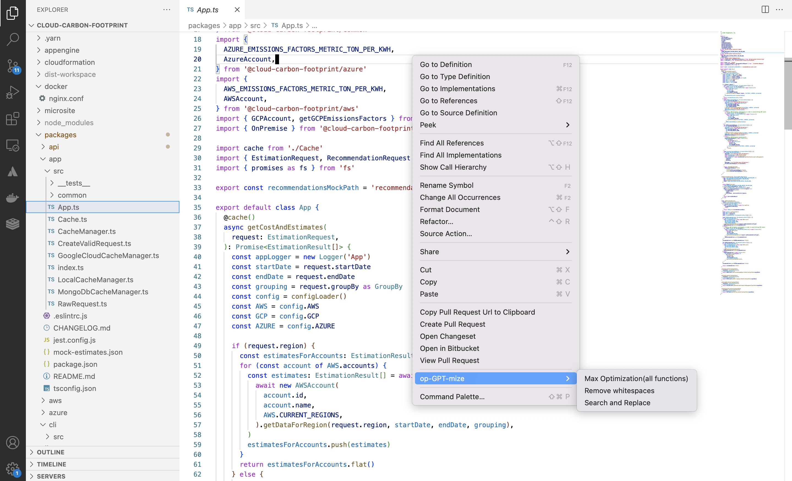

# op-gpt-mize README

ChatGPT is absolutely awesome. But, if you copy paste code that belongs to your organization, you're risking sharing confidential information with a third party. 

Futhermore, ChatGPT has some limitations when it comes to the amount of text (in the form of tokens) it can process in the free tier.

We aim to solve both these issues. 

## Features

Anonymize: The "searchAndReplace" command allows the user to search for a specific string of text and replace it with another string, which generating a new file. This is different from the inbuilt search and replace since you generate a new file that is ready to copy paste into ChatGPT without editing your original file

Optimize: The "removeWhitespaces" command removes comments, newlines, extra whitespaces and spaces between characters from the selected text, thereby increasing the amoutn of text you can share with ChatGPT in effect.

All Of The Above: Does what it says on the tin 😀

## Screenshots

It's also accessable via the command pallete. 

## Requirements

VS Code 1.70 ^

## Known Issues

None so far

## Release Notes

Release notes below

### 1.0.0

Initial release of the plugin

### 1.0.1

Copy to clipboard instead of opening a new window
